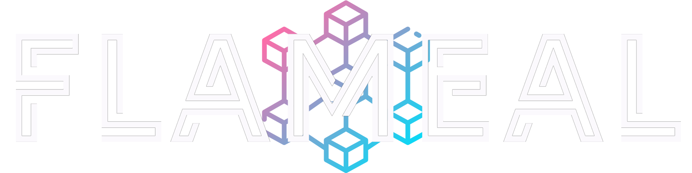

#

A decentralised software solution using blockchain technology that will help communities to effectively distribute food or other forms of help for the ones in need. 


## [Demo](https://www.youtube.com/embed/hvknVXfV-rk?si=vC_0ZDukHCtHneci)
 
[](https://www.youtube.com/embed/hvknVXfV-rk?si=vC_0ZDukHCtHneci)

## Documentation

[Documentation](https://lucian-duta.github.io/flameal-docs/)


## Installation

NodeJS and npm which can be downloaded from the [NodeJS website](https://nodejs.org/en/download/).

Truffle Framework

```bash
  npm install -g truffle
```


    
## Develop

Clone the project

```bash
  git clone https://github.com/lucian-duta/FLAMEAL.git
```

Go to the client directory

```bash
  cd FLAMEAL/client
```

Install dependencies

```bash
  npm install
```

Go to the server directory

```bash
  cd FLAMEAL/server
```

Install dependencies

```bash
  npm install
```


Start EVM(Ethereum Virtual Machine) in CLI - skip if using Ganache

```bash
  truffle develop
```

Compile and deploy contracts

Compile the contracts

```bash
  compile
```

Deploy the contracts

```bash
  migrate
```

Start the front end

```bash
  cd /client/src
  
  npm run start
```

Start the RESTful API

```bash
  cd /server
  
  npm start
```
Important: Before running the server make sure to update the MongoDB path.

## Tech Stack

**Client:** React

**Server:** Node, MongoDB, Express, Mongoose

**Smart Contracts**: Solidity

**EVM**: Truffle Suite


## Acknowledgements
 - I would like to thank Dr Bilyaminu Auwal Romo for his expert advice, encouragement and commitment to supporting me throughout this challenging project

### Code Acknowledgements

 - [Moesif For Dapp Example](https://github.com/Moesif/moesif-ethereum-js-example)
 - [briancodex](https://github.com/briancodex)
